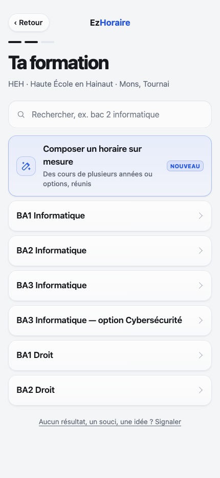
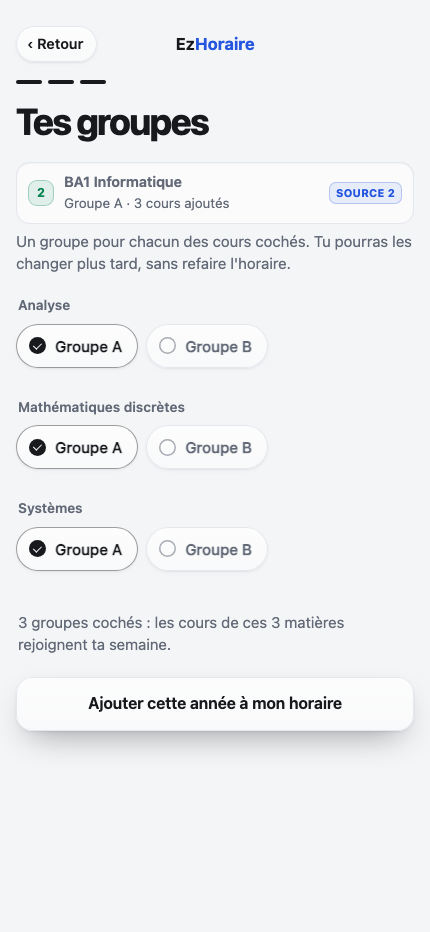
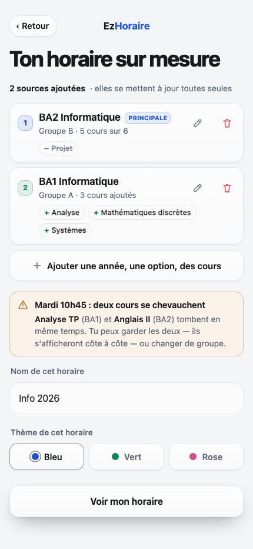
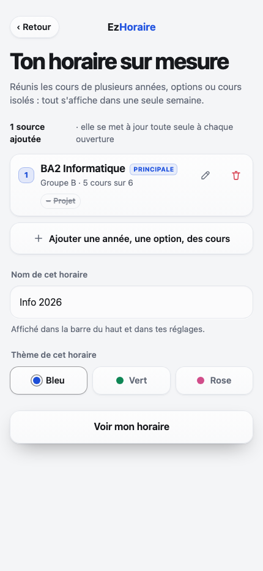
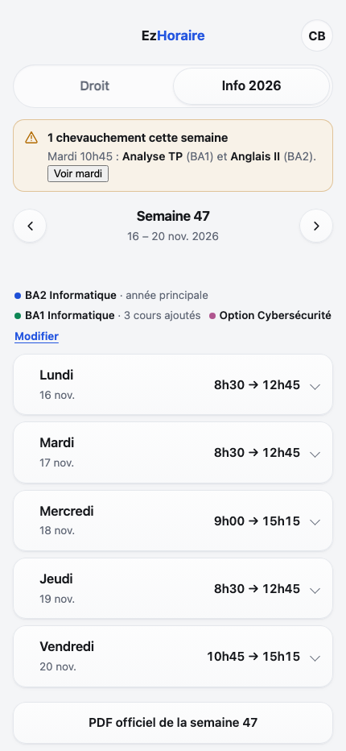
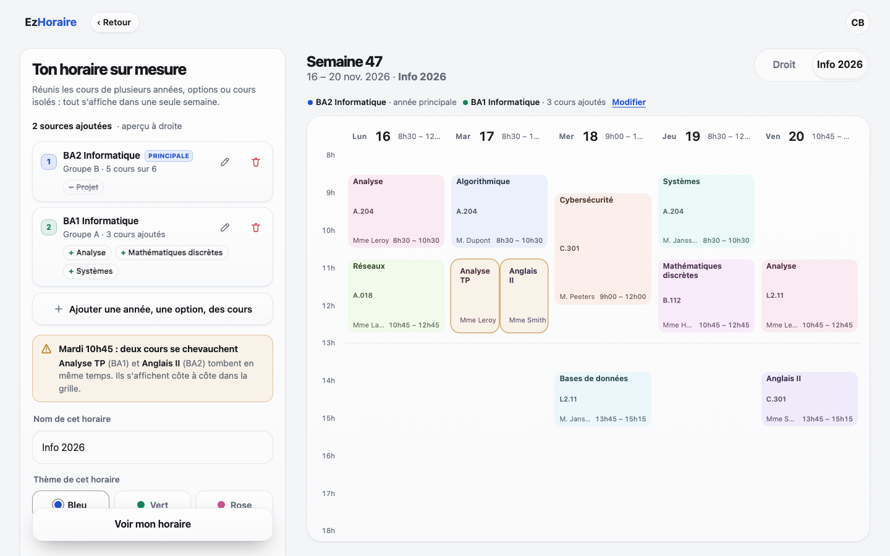

# Horaire sur mesure — plan détaillé

> Branche `horaireperso`. Ce dossier contient le plan, une maquette cliquable
> (`maquette.html`, `maquette-bureau.html`) et les captures ci-dessous.
> Rien n'est implémenté dans `index.html` : c'est une proposition à valider.

## 1. Le besoin

Aujourd'hui, un profil = **une** école + **une** formation + des groupes
(`{id, surnom, ecole, formation, groupes, theme}`). C'est le bon modèle
pour 95 % des étudiants, mais pas pour ceux qui sont **entre deux années** :

- **cours carrés / année en réserve** : un étudiant de BA2 repasse un ou
  deux cours de BA1 ;
- **cours isolés ou passerelle** : quelques cours d'une autre année que la
  sienne ;
- **options annuelles** : une option de BA3 suivie en même temps que sa
  propre année ;
- **réorientation** : un cours de l'ancienne formation gardé en même temps
  que la nouvelle.

Aujourd'hui, la seule solution est de créer **plusieurs horaires** dans
l'app : ils s'affichent l'un après l'autre, mais jamais ensemble. L'étudiant
doit faire la fusion de tête, et il ne voit pas les chevauchements (Analyse
TP de BA1 qui tombe en même temps qu'Anglais de BA2, par exemple).

**Objectif** : composer **un** horaire à partir de **plusieurs sources**,
affiché exactement comme un horaire normal, mis à jour par l'école, avec
les chevauchements signalés. Le cas type qui guide toute la maquette :
**3 cours de BA1, le reste de BA2** (cours carrés), plus, si besoin, une
option d'une autre année.

## 2. Périmètre (v1)

Une **source** = une formation d'une école + ses groupes, avec un
**rôle** : *année principale* (on garde tout et on décoche les cours qu'on
ne suit pas) ou *année d'ajout* (on ne coche que les cours qu'on ajoute).
C'est l'unité que l'app sait déjà charger : `api/horaires`, ou `api/ical`
pour un lien personnel.

- 2 à 6 sources, **d'une même école** en v1 (HEH, UMONS, Condorcet, ULB,
  UCLouvain). Les semaines d'une même école partent du même lundi et
  partagent les mêmes fériés : la fusion est fiable. Le mélange
  **inter-écoles** (HEH + UMONS) est repoussé en v2 : calendriers de congés
  différents, APIs différentes, PDF différents.
- Chaque source garde ses propres groupes (le même nom de groupe dans deux
  formations ne se mélange plus).
- L'horaire fusionné se met à jour **tout seul** à l'ouverture, comme un
  horaire normal (cache par source, inchangé).
- Les **chevauchements** sont détectés et affichés (bandeau + repère dans
  la semaine), mais ne bloquent pas la validation : un cours carré peut
  légitimement tomber en même temps qu'un cours dont on est dispensé.
- Éditable, synchronisé au compte, disponible hors ligne (si chaque source
  a déjà été ouverte une fois), s'affiche sur téléphone **et** sur
  ordinateur (grille côte à côte).

Hors périmètre v1, à garder en tête comme pistes :

- fusion inter-écoles ;
- cours ajoutés à la main (un cours qui n'existe pas au catalogue) ;
- partage public d'un horaire sur mesure / export image ;
- détection automatique (« on a vu que tu repasses Analyse ») ;
- un PDF unique combiné : les écoles publient un PDF **par formation**,
  impossible d'en fabriquer un officiel commun.

## 3. Parcours et écrans

Le parcours s'ajoute à la création existante sans la changer : mêmes
écrans école → formation → groupes, détournés en « mode source ».

### 3.1 Entrée — Réglages


- La carte de l'horaire sur mesure porte un **tag « Sur mesure »** et, en
  dessous, « 3 sources · BA1, BA2 et option » au lieu du nom de groupe
  (`texteGroupe()`, `index.html:6069`).
- L'entrée reste l'unique bouton **« Ajouter un horaire »**
  (`#btn-ajouter`), qui ouvre l'écran des écoles puis des formations.

### 3.2 Formation — la porte d'entrée



- Une **carte en tête de liste**, teintée à la couleur de l'accent, avec
  l'icône baguette, le titre « Composer un horaire sur mesure », le
  sous-titre « Des cours de plusieurs années ou options, réunis » et un
  badge **Nouveau**.
- Pourquoi ici : l'étudiant qui a un cas « entre deux années » est déjà en
  train de chercher sa formation ; c'est le moment où il faut le lui
  proposer. Les autres ne la touchent jamais et gardent le parcours actuel.
- Elle fonctionne aussi pour les écoles à recherche (ULB/UCLouvain), en
  tête de la liste de résultats.
- Aucun autre écran du parcours normal n'est modifié.

### 3.3 Composeur vide


Nouvelle vue `v-perso` (même langage que `v-groupes`) :

- titre **« Ton horaire sur mesure »**, aide d'une phrase ;
- cadre gravé **`vide-src`** : « Aucune source pour l'instant » + icône
  calques ;
- bouton principal **« Ajouter une année, une option, des cours »**
  (`+`) ;
- bloc **« Comment ça marche »** en 3 étapes numérotées (rassure : les
  sources restent à jour, c'est nous qui fusionnons).

### 3.4 Ajouter une source


- Réemploi **exact** de l'écran de formation (`ouvrirFormations()`,
  `index.html:4612`) : même recherche, mêmes rubriques, mêmes listes
  serveur (`api/formations`, `api/recherche`).
- En haut, un rappel **`src-rappel`** : pastille numérotée, nom de la
  source déjà présente, badge « 1 source ». La formation déjà ajoutée est
  marquée **« Déjà ajouté »** et désactivée.
- L'école est fixée par la 1re source ; l'écran ne propose que cette
  école en v1 (l'en-tête le rappelle).

### 3.5 Année principale (on décoche) ou année d'ajout (on coche)

C'est le cœur du cas « 3 cours de BA1, le reste de BA2 ». Chaque source a
un **rôle**, choisi avec le rail `.seg` de l'app, qui décide de ce qui est
coché au départ :


- **Année principale** (défaut de la 1re source) : tous les cours de
  l'année sont cochés, on **décoche** ceux qu'on ne suit pas (« Projet »,
  ici). Le compteur dit « 5 cours gardés sur 6 · 1 retiré » et le bouton
  « Garder ces 5 cours ». Zéro coché ⇒ bouton désactivé
  (« Garde au moins un cours »).
- Une année principale avec tout coché = l'année entière, exactement comme
  un horaire normal ; aucune case à toucher si on suit tout.
- Le rôle « principale » est mémorisé comme une **liste de retraits**
  (`source.sans`), pas comme une liste de cours gardés : si l'école ajoute
  un cours en cours d'année, il apparaît tout seul.


- **Cours à ajouter** (défaut des sources suivantes : la 2e année, une
  option) : rien n'est coché, on **coche** seulement les cours ajoutés
  (« Analyse », « Mathématiques discrètes », « Systèmes »). Compteur
  « 3 cours cochés sur 6 », bouton « Ajouter ces 3 cours ». Zéro coché ⇒
  désactivé.
- Le rôle « ajout » est une **liste de cours choisis** (`source.avec`) :
  plus courte à stocker, et sans surprise si l'école ajoute un cours qu'on
  n'a pas demandé.
- « Tout cocher / Tout décocher » au-dessus de la liste pour basculer d'un
  coup (et changer de rôle remet les cases au défaut du rôle).
- Si la formation n'a pas de groupes, on va directement au composeur.
- Une matière cochée qui disparaît (intitulé changé par l'école) est
  signalée dans le composeur, avec « Rechoisir les cours ».
- Pour l'ULB et l'UCLouvain, l'équivalent existe déjà : le sélecteur par
  codes (`rech.cours`, `rechVoirCours()` `index.html:4819`) construit un
  `PAR:CODE1,CODE2`, qui devient une source « cours à ajouter » ; un
  programme entier (`SINF11BA`) est une source « année principale ».

### 3.6 Groupes de la source



- Réemploi de l'écran de groupes (`ouvrirGroupes()` `index.html:5197`,
  `listerGroupes()` `index.html:5245`) : sections par cours, options,
  filtre au-delà de 20 groupes, même règle « au moins une sélection
  au-delà de 8 groupes » (`groupeObligatoire()`, `index.html:5464`).
- **Seuls les cours cochés** apparaissent : ici Analyse, Mathématiques
  discrètes et Systèmes, chacun avec son groupe. C'est exactement la
  réalité des écoles Hyperplanning (HEH, UMONS, Condorcet), où les
  groupes sont par cours.
- Le rappel de source est répété en haut (pastille 2, nom, badge
  « Source 2 ») pour ne jamais perdre de vue quelle année on règle.
- Bouton final : **« Ajouter cette année à mon horaire »** (au lieu de
  « Voir mon horaire ») → retour au composeur.

### 3.7 Composeur — sources et chevauchements



- Une **carte par source** (`srccard`) : pastille numérotée colorée, nom
  de la source, badge **Principale** sur l'année principale, détail
  (`Groupe B · 5 cours sur 6`, `Groupe A · 3 cours ajoutés`,
  `option annuelle`…), les cours retirés en pastilles barrées
  (`− Projet`) et les cours ajoutés en pastilles (`+ Analyse`), crayon
  (cours et groupes) et corbeille (retirer).
- Sous les sources, le bouton **« Ajouter une année, une option, des
  cours »**.
- **Alerte de chevauchement** (`choc`, ambre) : titre « Mardi 10h45 :
  deux cours se chevauchent », phrase qui nomme les deux cours et leur
  source, et rappelle qu'on peut garder les deux ou changer de groupe.
- Bloc **Nom de cet horaire** (`#bloc-surnom`, caché si c'est le premier
  horaire, comme aujourd'hui) et **thème** (`htmlChoixThemes`,
  `index.html:6166`).
- Bouton principal **« Voir mon horaire »**.


- Quand tout est clair : bandeau vert « Aucun cours en double ».
- Le compteur « 3 sources ajoutées » suit le nombre réel.
- Le composeur d'une source seule (première année posée) :



### 3.8 L'horaire fusionné



- **Exactement la même semaine** qu'un horaire normal : `rendre()`,
  `jours`, `cal`, couleurs par intitulé (`preparerCouleurs()`,
  `index.html:5883`).
- Sous la navigation de semaine, la **ligne des sources** : une pastille
  de couleur par source, son nom (« BA1 Informatique · 3 cours »), et le
  lien **Modifier**.
- Bandeau de chevauchement en haut, avec **« Voir mardi »** qui ouvre le
  jour concerné.
- En multi-horaires, la barre `seg` du haut reprend le surnom (« Info
  2026 ») comme aujourd'hui.


- Dans le déroulé d'un jour, chaque cours d'un horaire sur mesure gagne
  une ligne **« Source : BA1 Informatique · 3 cours choisis »** dans son
  détail (là où un horaire normal affiche le groupe) : on sait toujours
  d'où vient la séance.
- Les deux cours en conflit portent un repère **Chevauche** ambre (sur
  ordinateur, ils sont côte à côte dans la grille, comme deux cours d'un
  même groupe le font déjà via `couloirs()` `index.html:5906`).



- Sur ordinateur (≥ 1024 px), le composeur peut vivre **à côté** de
  l'aperçu : on voit la semaine se remplir à chaque source ajoutée. Les
  cours en conflit sont cernés d'ambre dans la grille.

### 3.9 PDF officiel


- Un horaire sur mesure n'a pas de PDF unique : le bouton devient
  **« PDF officiel »** avec un **sélecteur de source** (comme le
  sélecteur de groupe actuel, `majChoixPdf()` `index.html:5689`).
- Une école sans PDF (UCLouvain) ou une source « lien iCal » :
  l'entrée correspondante est absente du sélecteur ; si aucune source n'a
  de PDF, le bouton est masqué (`majBoutonPdf()` `index.html:3772`).

### 3.10 Modifier


- `⋮ → Modifier` (`modifierProfil()` `index.html:6254`) : un horaire sur
  mesure ouvre le **composeur en édition** plutôt que la fenêtre simple,
  avec les mêmes cartes de source (crayon = groupes, corbeille = retirer,
  bouton = ajouter), plus le nom et le thème.
- Supprimer une source retire ses cours de la semaine ; le nom et la
  couleur restent. Supprimer l'horaire entier reste inchangé
  (`supprimerProfil()` `index.html:6316`).
- Le crayon d'une source rouvre l'écran de groupes **de cette source**
  (`changerGroupe()` `index.html:6976` adapté).

## 4. Le moteur de fusion (le cœur technique)

### 4.1 Chargement

Chaque source est déjà récupérable et **mise en cache par formation** :

```
cleHoraire(ecole, formation, ical)   // index.html:2833
chargerHoraire(ecole, formation, ical) // index.html:4145
```

Nouveau : `chargerPerso(p)` fait un `chargerHoraire` par source en
parallèle, puis `fusionner()`. Rien ne change côté serveur : aucune
nouvelle route, aucun paramètre, le cache partagé (15 min, `api/horaires.py:28`)
absorbe l'usage — un horaire sur mesure à 3 sources ne coûte au plus que
3 appels à l'ouverture, et une seule fois par page grâce au cache local.

### 4.2 Règles, dans l'ordre

1. **Groupes de la source** : le filtre actuel, appliqué source par
   source (`sel = source.groupes` ; `!sel.length || !c.groupes.length ||
   c.groupes.some(g => groupeDans(sel, g))`, `index.html:5675`). C'est ce
   qui règle la collision des noms de groupes entre formations : chaque
   source filtre chez elle.
2. **Cours de la source** : selon le rôle, appliqué **avant** le filtre
   des groupes, y compris aux séances sans groupe (« toute la
   formation ») qui seraient gardées sinon :
   - année principale : garder `c.matiere ∉ source.sans` (liste de
     retraits ; vide = toute l'année) ;
   - année d'ajout : garder `c.matiere ∈ source.avec` (liste de cours
     choisis).
   Comparaison sur `c.matiere` nettoyé (`nettoyerMatiere()`
   `index.html:5423`).
3. **Alignement des semaines** : si `meta.premier_lundi` diffère, on
   décale les numéros de semaine de la source de `delta` semaines
   entières (positif ou négatif) ; si l'écart n'est pas un nombre entier
   de semaines (cas tordu), la source est **écartée** avec un avis
   « Cette année ne suit pas le même calendrier : ajoute-la dans un
   horaire séparé. » Les fériés sont décalés pareil (`FERIES` est indexé
   en jours depuis le premier lundi, `numJour()` `index.html:3584`).
4. **Dédoublonnage** : une séance identique donnée par deux sources
   (cours mutualisé) devient une seule séance, semaines fusionnées. Clé :
   `(matiere, jour, debut, fin, salles, profs)` — même esprit que le
   regroupement d'Hyperplanning (`api/_moteurs/hyperplanning.py:574`),
   appliqué entre sources. La source affichée est la première (la plus
   « principale »).
5. **Métadonnées** : `premier_lundi` de référence = celui de la première
   source ; `periode` = union des semaines ; `feries` = union ;
   `ts` = le plus récent.
6. **Couleurs** : `preparerCouleurs()` sur tous les intitulés fusionnés,
   triés — deux intitulés différents n'ont jamais la même couleur, et un
   même cours garde la même couleur d'une source à l'autre. (Effet de
   bord assumé : ajouter une source peut redistribuer des couleurs, comme
   quand on change de formation.)

### 4.3 Chevauchements

```
pour chaque jour :
  cours actifs cette semaine, triés par début
  deux cours se chevauchent si  debutA < finB  et  debutB < finA
  (fin == début suivant → simple enchaînement, pas un chevauchement)
```

- Au **composeur** : dès qu'une source est ajoutée (son horaire est déjà
  téléchargé par l'écran des groupes), on calcule et on affiche le
  bandeau. Pas de blocage.
- Dans l'**horaire** : bandeau « N chevauchement(s) cette semaine » +
  bouton vers le jour + repère « Chevauche » dans le jour.
- Sur **ordinateur** : côte à côte (le mécanisme `couloirs()` existe déjà
  pour les cours d'un même groupe) + contour ambre.

### 4.4 Affichage

`DATA` garde **le même format** qu'aujourd'hui
(`{meta, formation, groupes, cours}`), avec deux champs en plus :
`sourcesData` (les réponses brutes, pour l'édition et le PDF) et
`perso: true`. Conséquence : `rendre()`, `coursDe()`, `detailJour()`,
`rendreCal()`, `rendreInfos()` ne changent qu'à la marge. `COURS` est la
liste fusionnée filtrée.

## 5. Modèle de données

### 5.1 Profil

Aujourd'hui (`ezh_profils`, table `public.profils`) :

```json
{ "id": "p…", "surnom": "Droit", "ecole": "heh",
  "formation": "BAB1 - Droit", "groupes": ["Groupe A"], "theme": 2 }
```

Proposition — un champ `sources` optionnel, **rien d'autre ne bouge** :

```json
{ "id": "p…", "surnom": "Info 2026", "theme": 2, "ecole": "heh",
  "formation": "", "groupes": [],
  "sources": [
    { "ecole": "heh", "formation": "BA2 Informatique", "role": "principale",
      "groupes": ["Groupe B"], "ical": "", "surnom": "", "sans": ["Projet"] },
    { "ecole": "heh", "formation": "BA1 Informatique", "role": "ajout",
      "groupes": ["Groupe A"], "ical": "", "surnom": "Cours carrés",
      "avec": ["Analyse", "Mathématiques discrètes", "Systèmes"] }
  ] }
```

- `sources` absent ou vide ⇒ horaire normal, tout le code actuel
  fonctionne tel quel (c'est la garantie de non-régression).
- `surnom` par source : optionnel, défaut = `joliFormation(formation)`.
- `role` : `"principale"` (défaut de la 1re source) ou `"ajout"` (défaut
  des suivantes), modifiable sur l'écran des cours. Au plus une source
  principale : passer une autre source en principale rétrograde
  l'ancienne en `"ajout"` (ses cours gardés deviennent son `avec`).
- `sans` : cours **retirés** de l'année principale (liste vide = toute
  l'année, donc les nouveaux cours de l'école arrivent seuls).
- `avec` : cours **ajoutés** d'une année d'ajout (au moins un).
- On stocke l'intitulé exact de l'école, pas un index : le jour où
  l'école renomme un cours, on peut le dire et le réparer.
- `sources.length` entre 2 et 6. Une seule source n'est pas un perso :
  c'est un horaire normal.
- `ecole` reste rempli (école unique en v1) : tris, PDF, stats et tri de
  la liste des horaires continuent de fonctionner.

### 5.2 Compatibilité

- **Ancien client / nouvelle base** : `pullProfils()` (`index.html:3306`)
  lit une liste de colonnes explicite ; on y ajoute `sources` avec un
  **repli** si la colonne n'existe pas encore (même motif que `ical`,
  `index.html:3313`).
- **Nouveau client / ancienne base** : `pushProfils()` (`index.html:3357`)
  retente sans `sources` si la base n'est pas migrée (même motif). Dans ce
  cas le profil perso reste local à l'appareil ; on l'annonce une fois
  dans les Réglages (« cet horaire reste sur cet appareil : relance le
  `schema.sql` »). Décision à confirmer, voir §9.
- **Ancien client / profil perso en base** : la ligne n'est ni supprimée
  (la suppression distante est explicite, `supprimerProfilDistant()`,
  `index.html:3393`) ni écrasée (l'`upsert` d'un ancien client n'envoie
  pas `sources`, la colonne garde sa valeur). Au pire, l'ancien client ne
  voit pas l'horaire (il le filtre via `profilValide`). `formation` reste
  **vide** pour un perso, exprès : mieux vaut qu'un ancien client ne
  l'affiche pas du tout que d'afficher une année sur deux sans prévenir.

### 5.3 Supabase

```sql
alter table public.profils
  add column if not exists sources jsonb not null default '[]'::jsonb;

-- dans la contrainte profils_bornes :
and (jsonb_typeof(sources) = 'array')
and jsonb_array_length(sources) <= 6
and octet_length(sources::text) <= 20000
```

Le fichier `supabase/schema.sql` est rejouable, la contrainte est déjà
recréée à chaque passage (`schema.sql:75`) : l'ajout suit le mouvement.

### 5.4 Effets ailleurs

| Endroit | Changement |
|---|---|
| `tracerVisite()` `index.html:3405` | pour un perso, insérer `formation = "sur mesure"` (lisible dans le dashboard) ; `profil_id` inchangé. |
| `api/stats.py:366` | les profils sans formation tombent dans un seau **« Horaire sur mesure »** au lieu d'une ligne vide. |
| `dashboard.html` | colonne Comptes : afficher « sur mesure (N sources) » quand `sources` est là. |
| `suivi.js` | événements `perso_source_ajoutee`, `perso_chevauchement`, `horaire_perso_cree` ; incrémenter `EZH_VERSION` (`index.html:2609`). |
| `README.md` | une sous-section « Horaires sur mesure » dans *Fonctionnement*. |
| `aide/index.html` | une entrée : « Je repasse une année / j'ai des cours de plusieurs options ». |
| `confidentialite.html` | rien à changer : aucune donnée nouvelle. |

## 6. Implémentation (fichiers et fonctions)

Tout tient dans `index.html` ; l'API ne bouge pas.

1. **Modèle** : `profilValide()` (`2840`) accepte `sources` ;
   `sourcesValides(p)` + `estPerso(p)` ; normalisation au chargement
   (`2893-2926`) ; `surnomDefaut()` pour un perso = « Horaire sur mesure ».
2. **Composeur** : nouvelle vue `v-perso` ; `ouvrirPerso()` /
   `listerSources()` / `ajouterSource()` / `retirerSource()` ;
   l'écran formation et l'écran groupes reçoivent un « contexte source »
   (variable `choix.source` : null = parcours normal, objet = ajout à un
   perso), ce qui évite de dupliquer les écrans existants.
   **Sélection de cours** : `choisirCoursSource()` (rail Année principale /
   Cours à ajouter + liste cochable alimentée par `data.cours` groupés par
   `nettoyerMatiere()`, compteur et bouton qui disent le nombre), résultat
   dans `choix.source.sans` ou `choix.source.avec` selon le rôle.
3. **Fusion** : `chargerPerso(p)`, `fusionner(p, liste)`,
   `alignerSemaines(data, delta)`, `dedoublonner(cours)`,
   `chevauchements(cours)`, et le filtre des cours selon le rôle
   (`sans` / `avec`), appliqué avant le filtre des groupes.
4. **Affichage** : `installer()` (`5654`) accepte le résultat fusionné ;
   `afficherHoraire()` (`5716`) affiche « n sources » ; `detailJour()`
   (`5760`) ajoute la ligne Source ; `rendre()` (`5793`) gère les groupes
   perdus **par source** et le bandeau de chevauchement.
5. **Cycle de vie** : `demarrerHoraire()` (`7418`), `actualiser()`
   (`7327`) et `empreinte()` (`7323`) traitent les persos (cache partiel
   hors ligne : on affiche ce qui est là, la source manquante est
   signalée).
6. **Édition** : `modifierProfil()` (`6254`) ouvre le composeur ;
   `changerGroupe()` (`6976`) adapté ; `rendreListeProfils()` (`6086`)
   avec tag ; `texteGroupe()` (`6069`) = « n sources ».
7. **PDF** : `majBoutonPdf()` (`3772`) + `majChoixPdf()` (`5689`) avec
   sources ; `cleHauteurPdf()` (`6529`) par source pour mémoriser la
   hauteur du lecteur.
8. **Brouillon** : `sauverBrouillon()` (`4198`) /
   `reprendreBrouillon()` (`4228`) gardent `sources` et la source en
   cours, pour survivre à un rechargement au milieu d'un ajout.
9. **Option de testabilité** : sortir les fonctions pures de fusion dans
   `fusion.js` (chargé avant le script principal), testable avec un petit
   `node --test test_fusion.mjs`. À trancher (voir §9) : ça ajoute un
   fichier et un test Node dans un dépôt où les tests sont Python
   (`test_render_v2.py`, `test_geometry_math.py`).

## 7. Cas limites et messages

| Cas | Comportement prévu |
|---|---|
| Deux sources décrivent la même séance | Dédoublonnée ; semaines fusionnées ; source = la 1re. |
| Semaines non alignées (lundi différent non entier) | Source écartée de la fusion + avis explicite. |
| Une source ne répond plus chez l'école | Les autres s'affichent ; bandeau « L'horaire de BA1 n'a pas pu être mis à jour » + bouton Réessayer. Le cache local sert de filet. |
| Hors ligne, aucune source en cache | Message actuel d'échec de chargement (`horaire-status`). |
| Groupe disparu chez une source | Avis « Certains groupes de BA1 n'apparaissent plus » + « Rechoisir » qui ouvre cette source. |
| Matière cochée disparue (cours renommé) | Avis « Le cours “Analyse” n'apparaît plus dans BA1 » + « Rechoisir les cours » ; la matière est gardée pour ne pas perdre le choix si c'est un hoquet de l'école. |
| Nouveau cours chez l'école | Une année **principale** le prend automatiquement (elle ne stocke que les retraits) ; une année d'**ajout** l'ignore, c'est voulu. |
| Source déjà ajoutée | Impossible à re-choisir (« Déjà ajouté »). |
| Plus de 6 sources | Le bouton Ajouter est désactivé avec « Maximum atteint ». |
| Chevauchements | Signalés, jamais bloquants. |
| Source iCal (ULB/UCL) | Acceptée ; PDF masqué pour elle ; alignement des semaines possible. |
| Suppression de l'horaire | Inchangée (confirmation + suppression locale et cloud). |
| Ancien client qui reçoit un perso | Il ne l'affiche pas (voir §5.2) ; aucune perte de données. |

## 8. Découpage proposé

| Lot | Contenu | Estimation |
|---|---|---|
| 0 | Maquettes + plan (ce dossier) | fait |
| 1 | Modèle `sources`, `profilValide`, brouillon, schéma Supabase, repli base non migrée | 0,5–1 j |
| 2 | Composeur (vue, cartes, ajout/retrait, sélection de cours, réemploi formation + groupes en contexte source) | 1,5–2 j |
| 3 | Fusion (matières, alignement, dédoublonnage, `DATA`, affichage semaine, lignes de source) | 1–1,5 j |
| 4 | Chevauchements (calcul, bandeau, repères, grille bureau) | 0,5 j |
| 5 | Édition, PDF par source, carte Réglages | 0,5–1 j |
| 6 | Finitions : stats, suivi, aide, README, messages d'erreur, recette multi-écoles | 0,5–1 j |

Recette minimale avant de publier (chaque école HEH / UMONS / Condorcet /
ULB / UCLouvain) : 2 sources sans conflit, 2 sources avec conflit, une
source en année entière, une source en 3 cours, un groupe perdu, une
matière renommée, une source en panne, hors ligne, PDF, édition,
suppression, et un horaire normal **inchangé**.

## 9. Questions ouvertes

1. **Une école à la fois en v1** — d'accord, ou il faut tout de suite
   HEH + UMONS ? (Dans ce cas il faut aussi gérer deux calendriers de
   fériés, deux `premier_lundi` et deux PDF : le lot 3 double.)
2. **Base non migrée** : profil sur mesure **local seulement** en
   attendant `schema.sql` (proposé), ou blocage de la création avec un
   message ?
3. **Nom affiché** : « sur mesure » (proposé, court), « personnalisé »,
   « assemblage » ? Il apparaît dans la carte, le tag et l'aide.
4. **Sélection de cours** : rail « Année principale / Cours à ajouter »
   au-dessus de la liste (proposé) — le rôle par défaut suit l'ordre des
   sources (1re = principale, suivantes = ajout). D'accord, ou il faut un
   écran dédié « Comment veux-tu suivre cette année ? », plus visible mais
   un clic de plus ?
   Et : cocher des **matières** (proposé, lisible) ou des **codes de
   cours** quand l'école en publie (HEH/UMONS en ont dans `matiere`) ?
5. **Fonctions pures dans `fusion.js` + test Node** (proposé), ou tout
   dans `index.html` et recette manuelle ?
6. **Couleur de la pastille de source** : trois teintes fixes (bleu,
   vert, rose — proposé, cohérentes avec les thèmes), ou dérivées de
   `premier_lundi`/de l'ordre ?
7. **Le bandeau de chevauchement** doit-il rester visible en permanence
   dans la semaine, ou seulement dans le déroulé du jour concerné ?
8. **Cours libres** (ajouter un cours qui n'est pas au catalogue) : v2,
   ou il faut déjà prévoir le modèle ?
9. **Un lien iCal perso comme source** : on l'autorise dès la v1 (coût
   quasi nul) ou on le cache pour ne pas compliquer le composeur ?
10. **Le sélecteur de matière doit-il proposer « Tout cocher »** pour une
    année entière « presque » complète (ex. tout sauf un cours) ?

---

### Fichiers de ce dossier

- `maquette.html` — prototype **cliquable** (téléphone) : Réglages →
  Ajouter un horaire → formation → carte sur mesure → ajout d'une année →
  année principale ou cours à ajouter → groupes → composeur →
  semaine.
  Navigation aussi par ancre : `#reglages`, `#formation`, `#composer0`,
  `#composer`, `#ajout`, `#source-principal`, `#source-ajout`,
  `#ajoutgroupes`, `#composer2`, `#composer3`, `#horaire`, `#detail`,
  `#pdf`, `#modifier`.
- `maquette-bureau.html` — variante ordinateur (composeur + semaine
  côte à côte).
- `app.css` — copie fidèle du `<style>` de `index.html` (fichier extrait,
  pas retapé) : les maquettes utilisent les vrais composants.
- `maquette.css` — uniquement les styles nouveaux (cartes de source,
  sélecteur de cours, bandeau de chevauchement, badges).
- `maquette.js` — routeur d'écrans et rendu de la semaine de démo.
- `01…15-*.png` — captures de ce document.

Pour ouvrir la maquette : `python3 serve.py` (ou
`python3 -m http.server 8917`) puis
`http://localhost:8917/propositions/horaire-perso/maquette.html`.
